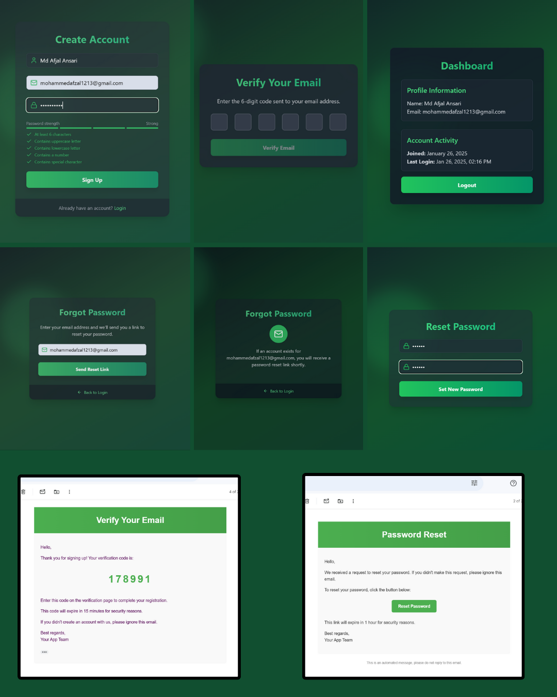

# 🚀 Project Name

This project consists of two main parts:
1. **Backend**: A Node.js-based server built with Express and MongoDB.
2. **Frontend**: A React-based application utilizing modern libraries like Vite, TailwindCSS, and Zustand.



## 🔧 Backend

### 📄 Description
The backend provides API endpoints and handles the business logic for the application. It includes user authentication, secure data handling, and connection to the MongoDB database.

### 🛠️ Technologies Used
- **Node.js**
- **Express**
- **Mongoose**
- **bcryptjs**
- **jsonwebtoken**
- **dotenv**
- **cookie-parser**
- **cors**
- **mailtrap**

### 📜 Scripts
- `start`: Starts the server using nodemon.

### 📝 Installation
1. Navigate to the backend directory:
   ```bash
   cd backend
   ```
2. Install dependencies:
   ```bash
   npm install
   ```
3. Start the server:
   ```bash
   npm start
   ```
4. Create a `.env` file with the necessary environment variables:
   ```plaintext
   MONGO_URI=<your_mongo_connection_string>
   JWT_SECRET=<your_jwt_secret>
   MAILTRAP_USER=<your_mailtrap_username>
   MAILTRAP_PASS=<your_mailtrap_password>
   ```

---

## 🎨 Frontend

### 📄 Description
The frontend is a React application that communicates with the backend API to display data and handle user interactions. It uses modern libraries like Zustand for state management, TailwindCSS for styling, and React Router for routing.

### 🛠️ Technologies Used
- **React**
- **Vite**
- **TailwindCSS**
- **React Router DOM**
- **Axios**
- **Framer Motion**
- **Zustand**
- **Lucide React**

### 📜 Scripts
- `dev`: Runs the development server.
- `build`: Builds the production-ready files.
- `lint`: Runs ESLint to check for issues in the code.
- `preview`: Previews the production build.

### 📝 Installation
1. Navigate to the frontend directory:
   ```bash
   cd frontend
   ```
2. Install dependencies:
   ```bash
   npm install
   ```
3. Run the development server:
   ```bash
   npm run dev
   ```

---

## 🛠️ Project Setup

1. Clone the repository:
   ```bash
   git clone <repository-url>
   ```
2. Set up the backend:
   ```bash
   cd backend
   npm install
   npm start
   ```
3. Set up the frontend:
   ```bash
   cd frontend
   npm install
   npm run dev
   ```

---

## 📜 License
This project is licensed under the ISC License.

## 👨‍💻 Author
Mohd Afzal

---


